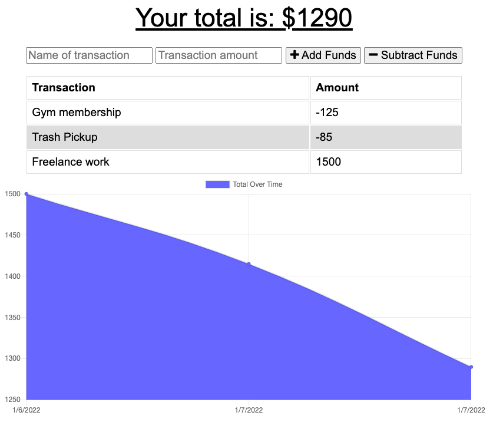
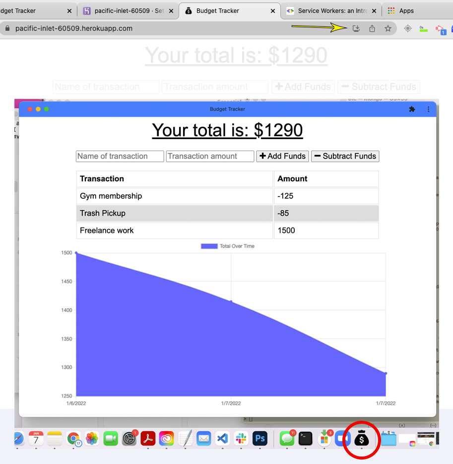

# Budget Tracker PWA 

  ## Table of Contents
  * [ Description ](#about)
  * [ Usage ](#usage)
  * [ Technologies ](#tech)
  * [ License ](#license)
  * [ Questions ](#questions)

  
  ## Description
   
  This is a budget tracking app. For this project, we were given the starter code for the functioning application and asked to add a service worker that will allow the user to interact with the app even with little or no internet connectivity. This app is also a Progressive Web Application (aka HTML-app or Web-app). This means that a user can install the app onto their desktop or mobile device for quick, offline access. In Google Chrome, click on the arrow/add button in the URL bar to download onto your desktop.
   
  

  
  ## Usage
  To use, simply enter a name for the transaction, enter an amount, and then tell the app if you're adding or subtracting funds.

  
  ## Technologies
  JavaScript\
  Node.js\
  Express.js\
  MongoDB\
  Mongoose\
  Service Workers

  
  ## License
  MIT - A short and simple permissive license with conditions only requiring preservation of copyright and license notices. Licensed works, modifications, and larger works may be distributed under different terms and without source code. ([Read more about the MIT license](https://choosealicense.com/licenses/mit/))

  
  ## Questions
  Feel free to reach out to me with any additional questions
  * [Find me on GitHub](https://github.com/cshepscorp/)
  * Email me at: sheppard.christy@gmail.com
